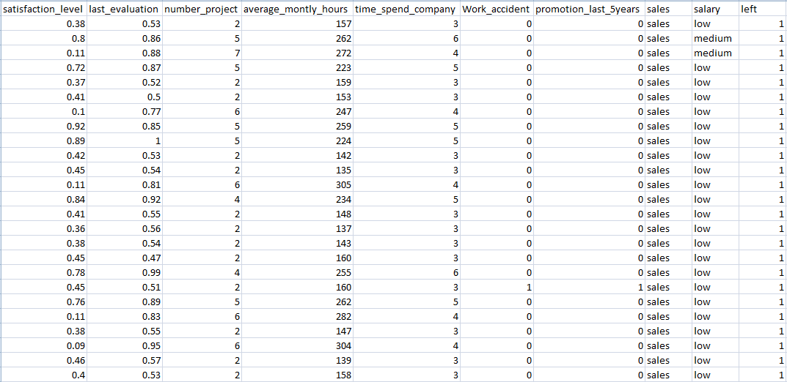
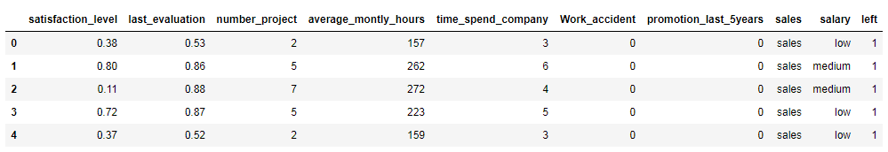

# Employee-Retention-Predictor
Predicting if employee will retain in the company using neural network

## Dataset source: 
https://www.kaggle.com/gummulasrikanth/hr-employee-retention


### There will be 3 notebooks, each having its own purpose as follow:
* Data cleaning
* Data preprocessing
* Model training and testing

# 1. Data cleaning
### Importing in libraries and dataset
```python
import pandas as pd
import numpy as np

raw_data = pd.read_csv('HR_Employee.csv')

raw_data.head()
```
Output:


### Copy dataframe so not to edit the original dataframe
```python
df = raw_data.copy()
```

### Checking info on dataframe. Ensuring there are no missing values
```python
df.info()
```
Output:
```
<class 'pandas.core.frame.DataFrame'>
RangeIndex: 14999 entries, 0 to 14998
Data columns (total 10 columns):
satisfaction_level       14999 non-null float64
last_evaluation          14999 non-null float64
number_project           14999 non-null int64
average_montly_hours     14999 non-null int64
time_spend_company       14999 non-null int64
Work_accident            14999 non-null int64
promotion_last_5years    14999 non-null int64
sales                    14999 non-null object
salary                   14999 non-null object
left                     14999 non-null int64
dtypes: float64(2), int64(6), object(2)
memory usage: 1.1+ MB
```

### Removing unwanted values and encoding categorical datas
```python
df['sales'].unique()
```
Output:
```
array(['sales', 'accounting', 'hr', 'technical', 'support', 'management',
       'IT', 'product_mng', 'marketing', 'RandD'], dtype=object)
```
```python
#dropping rows with value 'RandD'
df = df[df.sales != 'RandD']

df['salary'].unique()
```
Output:
```
array(['low', 'medium', 'high'], dtype=object)
```

```python
#mapping 'low' to 1, 'medium' to 2 and 'high' to 3
df['salary'] = df['salary'].map({'low':1,'medium':2,'high':3})
```

### Get dummies from column 'sales' while dropping the first column

```python
sales_columns = pd.get_dummies(df['sales'], drop_first = True)
df = df.drop(['sales'], axis=1)

df_with_dummies = pd.concat([df, sales_columns], axis=1)
```

### Reorder columns such that the target (column 'left') is the most right

```python
#get all the column names
df_with_dummies.columns.values
```
Output:
```
array(['satisfaction_level', 'last_evaluation', 'number_project',
       'average_montly_hours', 'time_spend_company', 'Work_accident',
       'promotion_last_5years', 'salary', 'left', 'accounting', 'hr',
       'management', 'marketing', 'product_mng', 'sales', 'support',
       'technical'], dtype=object)
```

```python
# rearrange column names in the order we want
column_names_reordered = ['satisfaction_level', 'last_evaluation', 'number_project',
       'average_montly_hours', 'time_spend_company', 'Work_accident',
       'promotion_last_5years', 'salary', 'accounting', 'hr',
       'management', 'marketing', 'product_mng', 'sales', 'support',
       'technical', 'left']

df_reordered = df_with_dummies[column_names_reordered]
```

### Exporting cleaned dataframe as csv file

```python
df_reordered.to_csv('HR_employee_cleaned.csv',index=False)
```
